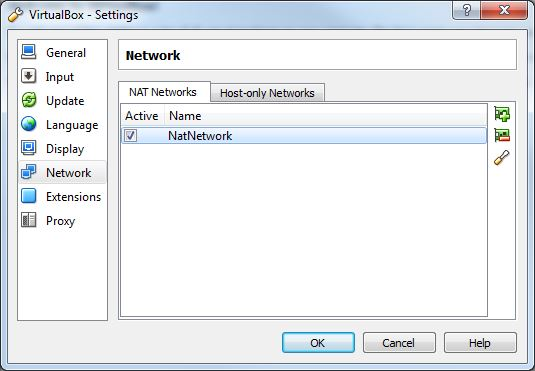

# CI In A Box
=============

## Overview

CI In a box is an effort to automate the generation of entire Continuous Integration infrastructure environments for (initially) Markets teams.  Thanks to rapid the evolution of cloud computing and open source - many tools have emerged enabling [infrastructure as code](http://devops.com/blogs/meet-infrastructure-code/).  

### Goals

*  Reduce the barrier to entry for Continuous Integration (and ultimately Continuous Delivery) for Markets Teams
*  Create a sustainable development environment ("The Factory") suitable for the development of Infrastructure Automation ("The Target CI Environment"")
*  Automate everyting that can and should be be automated

The techniques embraced here will also find application within the Target CI Environments themselves as well as for setting up developer workstations. These are things we wish to tackle down the road.

### Some Guiding Principles for Contributors

We hope this project expands beyond it's initial contributors

* Everything important must be buildable from source
* Minimize the number of *"snowflakes"* you depend on - that is binary artifacts that cannot be re-built from source code we control
* Seperate environmental configuration from the rest
* Write tests to validate
* Builds must be immutable - that is, every build should produce a new artifact
* ...and pretty much everything else from the [Continuous Delivery](http://www.thoughtworks.com/continuous-delivery) book
* Finally, expand this README.md as you learn more and pay it forward

## Documentation
-----

The following sections are used to capture knowledge

#### Phase 1: Bootstrapping the Development Environment (Genesis)

On a developer workstation we need to create the ability to build our base RHEL VM. This base VM will be used to create a Kickstart file so that we have the ability to create new VMs in a scripted fashion and upload them to vCloud or run them on other hardware targets.  This is also an enabling feature for local development when that includes spinning up VMs in addition to Docker containers.

### Base Box Creation
Starting with a RHEL 7 Server 64Bit ISO we want to generate a base VM with a few common things installed. We want the following software in all VMs:

* Docker
* Chef
* ...more (TBD)

We will be using the following tools to automate base box creation in a repeatable way

* veewee <https://github.com/jedi4ever/veewee> commit 349c569b28
* VirtualBox <https://www.virtualbox.org> version 4.3.12 r93733
* Ruby <http://cache.ruby-lang.org/pub/ruby/1.9/ruby-1.9.3-p545.zip> 
* RubyDevKit
* gem install bundler (unspecified but was 1.6.3)
* gem install veewee (unspecified but 0.3.12)
* Vagrant 1.6.

##### Workstation Prerequisites:

1. Install VirtualBox 4.3.12+
	* Install Notes: Due to a VirtualBox bug it will possibly break your Alstom Wireless connection.  In VirtualBox's Network Settings remove all interfaces and add back a NAT interface only and your wireless should work again. 
	
2. Add the location of the VirtualBox install to the PATH
2. Install Vagrant 1.6.3
3. clone the repo at <http://change-me-when-we-have-a-repo>
	* This will include the RHEL 7.0 Server ISO and RHEL Server Docker image

##### Manually Create a VirtualBox VM:

### TODO - Change to use veewee if successful!
#### Using Ruby Devkit 1.9.3x
#### Powershell Community Extensions 3.1.0

#### Veewee
1. veewee box define '
2. Had to install an MD5 utility to fill out the definitions.rb iso_md5 field.  Get it at http://www.microsoft.com/en-us/download/details.aspx?id=11533 
Connfigure 
#### TODO: Port adding subscription repos to veewee/vagrant

Using the VirtualBox UI - manually create a VirtualBox VM from the RHEL ISO included in the Git repo
	* VirualBox Settings
		* RAM: 8G
		* Display Mem: 128Mb+3D
		* 3D Hardware Acceleration: enabled
		* Disk Size: 20G
		* Hard Drive File Type: VMDK
		* Storage on physical hard drive is dynamically allocated
	* RHEL Installer Settings: 
		* Network: enable (eth0)
		* Hostname: localhost
		* Root passwd: Admin#1,
	 	* Language: English
	 	* Software Selection: Server with GUI
	 	
Finsh the install then RHEL will reboot.  You will be prompted for EULA - accept it.  You will be promped for kdump - enable it.  You will be prompted for subscription management registration - yes.  This will You will be prompted for Redhat Customer Portal credentials.  You will need to contact <mailto:jeff.spears@alstom.com> for access. 
	 	
At next startup you will be asked create a local user.  Create one (we chose `alstom/alstom123`).  
	
	root> wget http://mirrors.mit.edu/epel/beta/7/x86_64/epel-release-7-0.2.noarch.rpm
	root> sudo yum install epel-release-7-0.2.noarch.rpm
	root> sudo yum install docker-io
	root> sudo subscription-manager repos --enable rhel-7-server-optional-rpms 
	root> sudo subscription-manager repos --enable rhel-7-server-extras-rpms
	root> sudo subscription-manager repos --enable rhel-7-server-thirdparty-oracle-java-rpms
	  
Now snapshot the image for use later.

##### Use RHEL VM to generate Kickstart File

RHEL automatically creates a kickstarter file in the root filesystem based on the settings entered during the install.  We will use this kickstarter file as a template for unattended installs as part of scripting the VM creation.

* Get a VMWare ISO loaded into our vCloud environment.  Once that's created we can create a base VM to clone for various purposes.
* Get a VMWare VM based on RHEL 7.0 up and running on R&D's vCloud.  R&D has set up an organization at:
	* <https://vcloud.rnd.resource.corp/cloud/org/GENISIS> or 
	* <http://10.166.162.11/cloud/org/GENISIS>
* The first VM will serve as our primary development machine.  We need to install:
	* Java 7,8
	* Ruby 1.9.3+
	* Stash (without Postgres for now)
	* Docker (if it's not baked in - update otherwise)
	* Docker Registry
	* Thoughtwork Go
	

