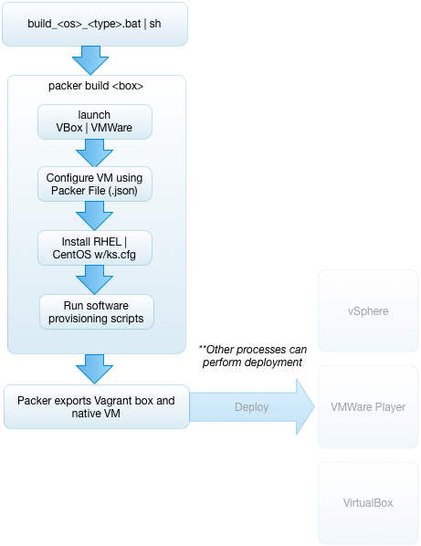

# Base VM Generation

## Overview

These are the implementation details for Base VM Generation.  We use [Packer](http://www.packer.io) and [Vagrant](http://www.vagrantup.com) for VM creation. But, Vagrant [relies on pre-built minimal VM images to create new VMs from](http://docs.vagrantup.com/v2/boxes/base.html).  Unfortunately Vagrant does not provide automation for this task.  For creating base VMs (base-boxes) we need another tool - Packer. 

### Packer for Creating Base VMs

[Packer](http://www.packer.io) is a tool created to fill the gap left by Vagrant.  It provides an abstraction over vendor-specific Virtualization technologies and software provisioning strategies to provide a more consistent way of describing and building a base VM from an operating system ISO.  In this case we are using VirtualBox (any), VMWare Fusion (Mac), VMWare Workstation (Windows) as the virtualization tool to do the initial creation of the VM (driven by Packer) and shell scripts to install (provision) the base software.  The basic workflow is captured in driver scripts in the `bin` directory desribed as follows:

1. Packer tells VirtualBox or VMWare (Fusion | Workstation) to create the VM using information from a Packer json file.  We have seperated the specific OS/Virtualization-technology combinations into thier own Packer using a naming convention <os>_<virtualization technology>.json 

		Example: centos-7.0-x64_virtualbox.json
	
2. Packer tells the virtualization program where the ISO is with the OS distribution and provides (in the RHEL/CentOS case) a Kickstart file to allow for unattended OS initial installation and configuration.
3. Once the VM is created, Packer tells the virtualization program to add the VM as a box for Vagrant to use later to create other VMs.  The process also produces a virtualization-technology-specific VM suitable for launching and inspecting (that is - a VMWare VM or a VirtualBox VM)
4. Since we produce both a VMWare VM and a Vagrant Box we have some flexibility as how we will do automated provisioning to vSphere/vCloud (__*work in progress*__)

### VM Definitions 
This project currently supports the creation of two OS types of base-boxes (with three VM variants).  Each is described by a different Packer file.  

* RedHat Enterprise Linux (RHEL)
	* [VirtualBox](rhel-7.0-x64/rhel-7.0-x64_virtualbox.json)
	* [VMWare](rhel-7.0-x64/rhel-7.0-x64_vmware.json)
* CentOS Packer
	* [VirtualBox](centos-7.0-x64/centos-7.0-x64_virtualbox.json) 
	* [VMWare](centos-7.0-x64/centos-7.0-x64_vmware.json)

The for each base-box the Packer file describes:

* The basic VM setup:
	* Hard Disk size/type
	* Number of CPUs
	* Amount of Memory
	* Basic Networking
	* OS Type
	* Where the ISO is	
*  Security
	* SSL Credentials
* OS Install Configuration
	* For RedHat and Centos this is a [Kickstart file (example for CentOS)](centos-7.0-x64.http/ks.cfg) found in the `http` subfolder. The Kickstart file's role is described below
* Software to install
	* For the Linux case we use a collection of shell script files.  Packer iterates over the collection of script files and executes them inside the VM to install software.  See the details in Post Install Files section below

#### Kickstart Files

[Kickstart](http://fedoraproject.org/wiki/Anaconda/Kickstart) files are RedHat's way of doing unattended OS installation and configuration.  There are basically three ways to create a Kickstart file:

* Obtain one already created somewhere else and modify it
* If you know the syntax simply author one
* Manually (interactively) install CentOS or RHEL - configure it - and a Kickstart file will be generated in the root of the filesystem  

The kickstart file for the base-box VM (RHEL) is [ks.cfg](definitions/rhel7-server-x64-base/ks.cfg).  The Kickstart file does the following:

* Tells the bootloader to install instead of upgrade
* Configures the keyboard layout
* Configures the network
* Sets the (encryped) root password
* Disables the firewall (for now)
* Enables shadow passwords
* Disables SELinux (for now)
* Set the timezone (for the factory we use PST)
* Configures the location to Master Boot Record (mbr)
* Forces the kickstart installation to run in text mode
* Configures autopartition
* Installs sudo
* Creates the vagrant group/user and adds it to the sudoers file

After the basic creation of the VM and installation of the OS Veewee uploads and runs the postinstall_files (scripts) to provision any software in the VM.

#### Post Install Files (Software Provisioning)

Since RHEL and CentOS come from the same codebase their configuration is nearly identical.  RHEL is an edition with commercial licensed support, and CentOS is an open-source, community supported edition.  The main difference is that we don't register CentOS with RedHat Customer Portal and we don't subscribe to RHEL specific repositories.

In Packer files the `provisioners` section specifies what scripts to run after the VM comes up.  This only happens during construction of the VM.

The current base-box definitions perform the following software installation and system configurations:

##### setup.sh
* RHEL only
	* Registers the image with the RedHat Customer Portal sourcing the credentials using a supplied rhcp.properties file
	* Sets up subscriptions to RedHat specific YUM repositories:
		* **rhel-7-server-optional-rpms** - needed to get docker-registry
		* **rhel-7-server-extras-rpms** - needed to get various RedHat reviewed RPMs
		* **rhel-7-server-thirdparty-oracle-java-rpms** - so we can use the official Java RPMs from Oracle
* Installs the following minimal packages:
	* **bzip2** - Many tar archives are compressed as bz2.  This allows tar to decompress them
	* **gcc-c++** - needed for building from source
	* **make** - needed for building from source
	* **kernel-devel-rhel** - needed for building VirtualBox Guest Additions
	* **linux-kernel-headers** - needed for building VirtualBox Guest Additions 
	* **zlib-devel** - needed for building various packages including Git
	* **openssl-devel** - needed for TBD
	* **readline-devel** - needed for TBD
	* **sqlite-devel** - needed for TBD
	* **perl** - needed for TBD
	* **wget** - needed to download source packages and other binary dependencies
	* **dkms** - Dynamic Kernal Module Support - needed for building VirtualBox Guest Additions
	* **nfs-utils** - needed for building VirtualBox Guest Additions
* Installs X-Windows
	* Yum install **X-Windows System** (group) - needed for building VirtualBox Guest Additions
* Performs System Configurations:
	* Configure ssh to not use DNS	- we can't rely on DNS in all deployment environments
	* Turns off non-essential services
	* __TODO: Chris and Ron to review how we're handling vagrant user setup.  Currently we create the vagrant user in ks.cfg, add it to sudo-ers in setup.sh, then setup keys in vagrant.sh. Seems all this should happen in ks.cfg__

##### docker.sh (TODO - Chris and Ron to review - Does ANY VM not need docker?  We should think about re-introducing docker back into our base VM image)
~~* Installs [Docker](http://www.docker.com) from the EPEL YUM repo - Docker will be used to package and deploy CI applications (as well as by pipelined automated deployments for integration testing)
* Configures the docker service to start a system start~~

##### vagrant.sh
This script sets up and configures [Vagrant](http://www.vagrantup.com) support

__(TODO Revise after we sort out where all the vagrant support is implemented)__

~~* Adds the vagrant user:group so vagrant provision software
* Adds vagrant user to the wheel group
* Adds vagrant to sudoers file
* Configures vagrant ssh keys (**TODO: Need to bring this in-house quickly!**)~~
##### virtualbox-guest-additions.sh | vmware-guest-additions.sh
* Builds and installs the VirtualBox Guest Additions by using an ISO mount - this is needed for exporting to the OVF portable VM format

##### compact.sh
* Zeros out the empty space on the VM hard disk to conserve space
* Removes any un-needed yum repo files
* Remove all uploaded shell scripts and credentials files
* Remove the MAC address from the network configuration (VirtualBox only - Packer takes care of this automatically for VMWare based builders)

### Next Steps

Once a base-box is created it can be imported to Vagrant, other automation processes can do the work of creating application-specific VMs.  The first application-specific VM to be created is the ["factory-vm"](../factory-vm)
