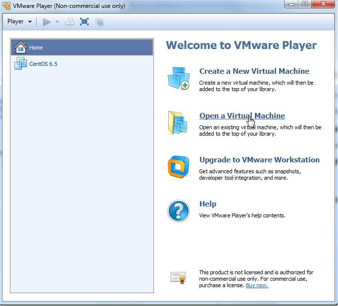
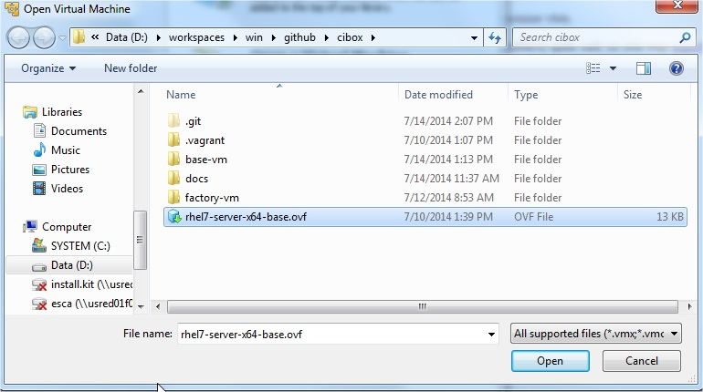
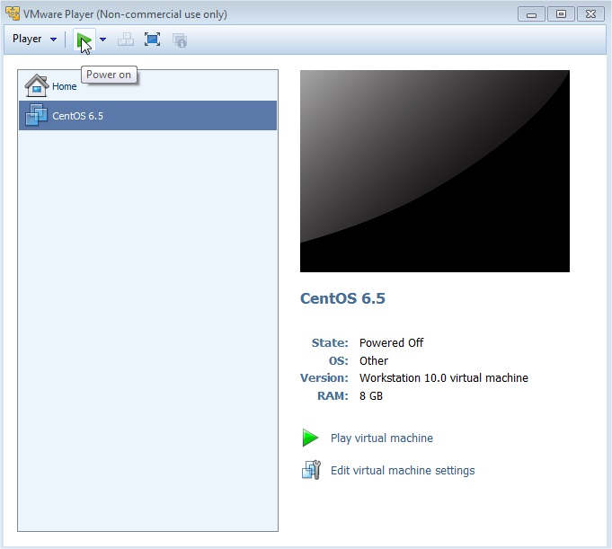

# "CI in a Box" Virtual Machine Providers

"CI in a Box" relies on [Packer](http://www.packer.io/) to provision VMs.  

Packer supports [VirtualBox](https://www.virtualbox.org/) (among others) quite well; so one may [export](https://www.virtualbox.org/manual/ch08.html#vboxmanage-export) to `.ovf`, a standard, portable [format](http://en.wikipedia.org/wiki/Open_Virtualization_Format).

## Exporting with VBoxManage

    VBoxManage export <your_vbox> --output <your_vbox>.ovf
    
    
## Importing to VMWare Player

Open [VMWare Player](https://my.vmware.com/web/vmware/free#desktop_end_user_computing/vmware_player/6_0).

Open a Virtual Machine.

    
Choose a `.ovf` file to import.

Wait for import to complete.

Launch VM.

## Uploading to VMWare vCloud
    
    // TODO
    